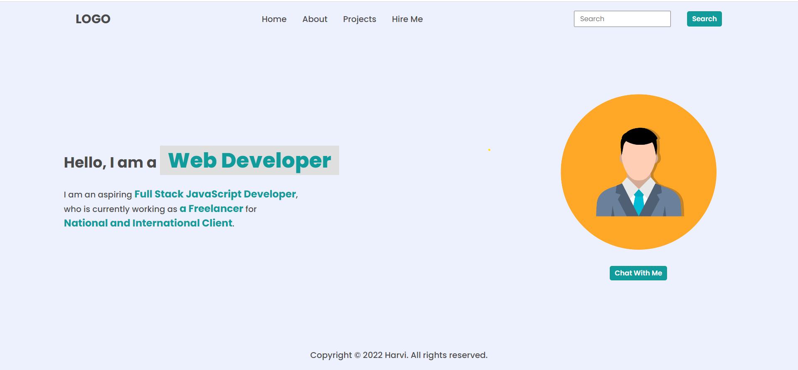
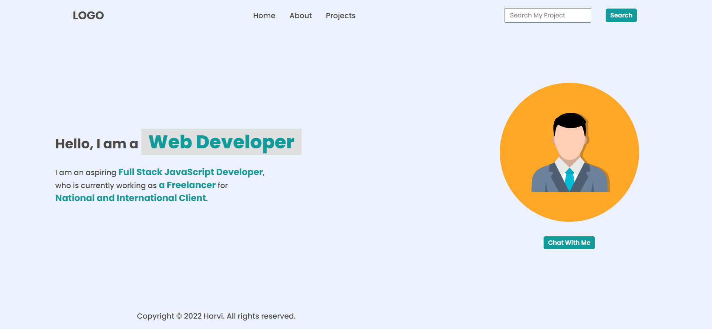

## **Task 1**

The user has to append new element **Projects** and **Hire Me** after about in navbar and remove social icons from footer.

### **After Update**


### **Project Solution**
```
let element1 = document.querySelector("header nav ul li:last-child")
element1.innerHTML = "<a>Projects</a>"

let element2  = document.createElement("li")
element2.innerHTML = "<a>Hire Me</a>"

let element3 = document.querySelector("header nav ul")
element3.appendChild(element2)

let footer = document.querySelector("footer ul")
footer.remove()
```

## **Task 2**

The user has to append new element **Projects** after about in navbar and add "search my project" placeholder inside search.

### **After Update**


### **Project Solution**
```
let element1 = document.querySelector("header nav ul li:last-child")
element1.innerHTML = "<a>Projects</a>"

let element2 = document.querySelector(".search-field input")
element2.placeholder = "Search My Project"

let footer = document.querySelector("footer ul")
footer.innerHTML = ""
```

## **Task3**

The user has to append new element **Projects** after about in navbar and change the text content of hero section.

### **After Update**


### **Project Solution**
```
let element1 = document.querySelector("header nav ul li:last-child")
element1.innerHTML = "<a>Projects</a>"

let element2 = document.querySelectorAll(".hero-left-section p span")
element2[1].textContent = "an Employee"
element2[2].textContent = "iNeuron Intelligence Pvt Ltd"
```


## **Task4**

The user has to append new element **Projects** after about in navbar and change the image

### **After Update**


### **Project Solution**
```
let element1 = document.querySelector("header nav ul li:last-child")
element1.innerHTML = "<a>Projects</a>"

let element2 = document.querySelector(".hero-right-section img")
element2.src = "./hitesh.jpg"
```


## **Task5**

The user has to append new element **Projects** after about in navbar and add **Support me** button after "chat with me"

### **After Update**


### **Project Solution**
```
let element1 = document.querySelector("header nav ul li:last-child")
element1.innerHTML = "<a>Projects</a>"

let element2 = document.querySelector(".hero-right-section-btns")
let button = document.createElement('button')
button.innerHTML = "Support Me"
element2.append(button)
```